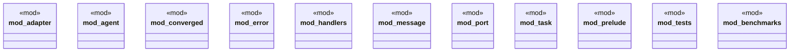

# `crates/ggen-lsp/src/a2a_mcp/a2a_generated/mod.rs`

Source SHA-256: `27538f28b78c7d769821f97fb403b033eb75167124061b5bae7bc34fb2f01121`

## Dependencies

- `adapter::{ Adapter, AdapterCapabilities, AdapterError, BaseAdapter, JsonAdapter, XmlAdapter, }`
- `agent::{Agent, AgentBehavior, AgentFactory}`
- `converged::{ AgentCapabilities, AgentCommunication, AgentError, AgentExecution, AgentHealth, AgentIdentity, AgentLifecycle, AgentMetrics, AgentProtocol, AgentSecurity, AgentState, AuditConfig, AuditEvent, AuthenticationConfig, AuthenticationMethod, AuthenticationProvider, AuthorizationConfig, AuthorizationModel, AuthorizationRole, Capability, ComparisonOperator, ComplianceConfig, ComplianceControl, ComplianceFramework, ComplianceRequirement, ComplianceStandard, ConvergedMessage, ConvergedMessageType, ConvergedPayload, DataFormat, DestinationType, EncryptionAlgorithm, EncryptionConfig, EncryptionKey, EncryptionMode, EncryptionRequirements, ExecutionMode, ExecutionStrategy, HandlerAction, HandlerPriority, HandlerStatus, HealthStatus, LatencyRequirements, MessageEnvelope, MessageLifecycle, MessageRouter, MessageRouting, MessageState, Permission, PermissionScope, PermissionType, PolicyEffect, PolicyPriority, PolicyType, ProviderType, QoSLevel, ReliabilityLevel, RequirementType, ResourceConstraints, RetentionPolicy, SecurityClassification, SecurityPolicies, SecurityPolicy, SecurityRule, ThroughputRequirements, UnifiedAgent, UnifiedAgentBuilder, UnifiedContent, ValidationAction, ValidationRule, ValidationSeverity, }`
- `criterion::{black_box, criterion_group, criterion_main, Criterion}`
- `error::{A2AResult, AgentError as UnifiedAgentError}`
- `message::{ Message, MessageError, MessageHandler, MessagePriority, MessageResponse, MessageStatus, MessageType, }`
- `port::{BasicPort, Port, PortData, PortError, PortStats, PortStatus, PortType}`
- `super::*`
- `super::{ A2AResult, Adapter, AdapterCapabilities, AdapterError, Agent, AgentBehavior, AgentCapabilities, AgentCommunication, AgentError, AgentExecution, AgentFactory, AgentHealth, AgentIdentity, AgentLifecycle, AgentMetrics, AgentProtocol, AgentSecurity, AgentState, AuditConfig, AuditEvent, AuthenticationConfig, AuthenticationMethod, AuthenticationProvider, AuthorizationConfig, AuthorizationModel, AuthorizationRole, BaseAdapter, BasicPort, Capability, ComparisonOperator, ComplianceConfig, ComplianceControl, ComplianceFramework, ComplianceRequirement, ComplianceStandard, ConvergedMessage, ConvergedMessageType, ConvergedPayload, DataFormat, DestinationType, EncryptionAlgorithm, EncryptionConfig, EncryptionKey, EncryptionMode, EncryptionRequirements, ExecutionMode, ExecutionStrategy, HandlerAction, HandlerPriority, HandlerStatus, HealthStatus, JsonAdapter, LatencyRequirements, Message, MessageEnvelope, MessageError, MessageHandler, MessageLifecycle, MessagePriority, MessageResponse, MessageRouter, MessageRouting, MessageState, MessageStatus, MessageType, Permission, PermissionScope, PermissionType, PolicyEffect, PolicyPriority, PolicyType, Port, PortData, PortError, PortStats, PortStatus, PortType, ProviderType, QoSLevel, ReliabilityLevel, RequirementType, ResourceConstraints, RetentionPolicy, SecurityClassification, SecurityPolicies, SecurityPolicy, SecurityRule, Task, TaskError, TaskExecutor, TaskPriority, TaskResult, TaskStatus, ThroughputRequirements, UnifiedAgent, UnifiedAgentBuilder, UnifiedAgentError, UnifiedContent, ValidationAction, ValidationRule, ValidationSeverity, XmlAdapter, }`
- `task::{Task, TaskError, TaskExecutor, TaskPriority, TaskResult, TaskStatus}`

## Standing

- Structural parse: `ALIVE`
- Runtime behavior: `UNKNOWN`
