# `crates/ggen-lsp/src/a2a_mcp/a2a_generated/port.rs`

Source SHA-256: `f3b4fdea6b5152737ee32f8b25bf1df5ad27f4fb9f3b2597ebaf2609beddabaa`

```mermaid
classDiagram
    class struct_PortConfig {
      <<struct>>
      +"id: String"
      +"name: String"
      +"port_type: PortType"
      +"config: PortConfigInternal"
      +"status: PortStatus"
      +"metadata: HashMap~String"
    }
    class struct_PortData {
      <<struct>>
      +"config: PortConfig"
      +"status: PortStatus"
    }
    class enum_PortType {
      <<enum>>
    }
    class struct_PortConfigInternal {
      <<struct>>
      +"max_message_size: usize"
      +"message_timeout: u64"
      +"buffered: bool"
      +"buffer_size: usize"
      +"parameters: HashMap~String"
    }
    class enum_PortStatus {
      <<enum>>
    }
    class trait_Port {
      <<trait>>
      +"id(&self) -~ &str"
      +"name(&self) -~ &str"
      +"port_type(&self) -~ PortType"
      +"status(&self) -~ PortStatus"
      +"initialize(&mut self, config: PortConfig) -~ Result~(), PortError~"
      +"connect(&mut self, target_port_id: &str) -~ Result~(), PortError~"
      +"disconnect(&mut self) -~ Result~(), PortError~"
      +"send(&mut self, message: &serde_json::Value) -~ Result~(), PortError~"
      +"receive(&mut self) -~ Result~serde_json::Value, PortError~"
      +"is_ready(&self) -~ bool"
      +"get_stats(&self) -~ PortStats"
      +"shutdown(&mut self) -~ Result~(), PortError~"
    }
    class struct_PortStats {
      <<struct>>
      +"messages_sent: u64"
      +"messages_received: u64"
      +"connection_attempts: u64"
      +"successful_connections: u64"
      +"failed_connections: u64"
      +"bytes_sent: u64"
      +"bytes_received: u64"
      +"last_message_timestamp: Option~chrono::DateTime~chrono::Utc~~"
    }
    class struct_PortError {
      <<struct>>
      +"message: String"
      +"error_type: PortErrorType"
      +"details: Option~serde_json::Value~"
    }
    class enum_PortErrorType {
      <<enum>>
    }
    class struct_BasicPort {
      <<struct>>
      +"port: PortData"
      +"connected_to: Option~String~"
      +"stats: PortStats"
    }
    class struct_PortRegistry {
      <<struct>>
      +"ports: HashMap~String"
    }
    class mod_tests {
      <<mod>>
    }
    note "BasicPort"
    note "Default for PortConfig"
    note "Default for PortConfigInternal"
    note "Default for PortData"
    note "Default for PortRegistry"
    note "Port for BasicPort"
    note "PortConfig"
    note "PortConfigInternal"
    note "PortData"
    note "PortError"
    note "PortRegistry"
    note "std::fmt::Display for PortErrorType"
```

## Dependencies

- `async_trait::async_trait`
- `std::collections::HashMap`
- `super::*`

## Standing

- Structural parse: `ALIVE`
- Runtime behavior: `UNKNOWN`
