# `crates/ggen-lsp/src/a2a_mcp/a2a_generated/task.rs`

Source SHA-256: `af4b99dba0a3f681300fbb63e3de447a97a88ec470d6d2300ea84090afd66773`

```mermaid
classDiagram
    class struct_Task {
      <<struct>>
      +"id: String"
      +"name: String"
      +"task_type: String"
      +"input: serde_json::Value"
      +"expected_output: serde_json::Value"
      +"dependencies: Vec~String~"
      +"priority: TaskPriority"
      +"status: TaskStatus"
      +"timeout: Duration"
      +"metadata: HashMap~String"
    }
    class enum_TaskPriority {
      <<enum>>
    }
    class enum_TaskStatus {
      <<enum>>
    }
    class trait_TaskExecutor {
      <<trait>>
      +"execute(
        &self, task: &Task,
    ) -~ impl std::future::Future~Output = Result~TaskResult, TaskError~~ + Send"
      +"can_handle(&self, task_type: &str) -~ bool"
      +"max_parallel_tasks(&self) -~ usize"
    }
    class struct_TaskResult {
      <<struct>>
      +"task_id: String"
      +"output: serde_json::Value"
      +"metadata: HashMap~String"
      +"execution_time: Duration"
    }
    class struct_TaskError {
      <<struct>>
      +"message: String"
      +"error_type: TaskErrorType"
      +"details: Option~serde_json::Value~"
    }
    class enum_TaskErrorType {
      <<enum>>
    }
    class struct_DefaultTaskExecutor {
      <<struct>>
      +"max_parallel: usize"
    }
    class mod_tests {
      <<mod>>
    }
    note "Task"
    note "TaskError"
    note "TaskExecutor for DefaultTaskExecutor"
    note "TaskResult"
```

## Dependencies

- `std::collections::HashMap`
- `std::time::Duration`
- `super::*`

## Standing

- Structural parse: `ALIVE`
- Runtime behavior: `UNKNOWN`
