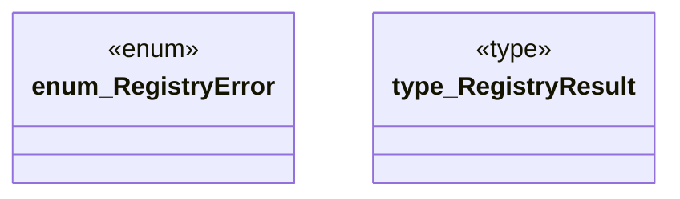

# `crates/ggen-lsp/src/a2a_mcp/a2a_registry/error.rs`

Source SHA-256: `33b0f9d911bf804f5458e2feb525304229ea3ae53a99777b4dd457e7b31f6672`

## Dependencies

- `std::time::Duration`

## Standing

- Structural parse: `ALIVE`
- Runtime behavior: `UNKNOWN`
