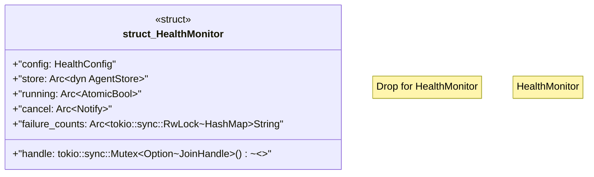

# `crates/ggen-lsp/src/a2a_mcp/a2a_registry/health.rs`

Source SHA-256: `a0ba0e166887f3232a8d1a47eb2db523057c0bbd72df1ee7d191f11e40f6f01c`

## Dependencies

- `crate::a2a_mcp::a2a_registry::error::RegistryError`
- `crate::a2a_mcp::a2a_registry::store::AgentStore`
- `crate::a2a_mcp::a2a_registry::types::HealthConfig`
- `crate::a2a_mcp::a2a_registry::types::HealthStatus`
- `std::collections::HashMap`
- `std::sync::Arc`
- `std::sync::atomic::{AtomicBool, Ordering}`
- `std::time::Duration`
- `tokio::sync::Notify`
- `tokio::task::JoinHandle`
- `tokio::time::{interval, timeout}`
- `tracing::{debug, info, warn}`

## Standing

- Structural parse: `ALIVE`
- Runtime behavior: `UNKNOWN`
