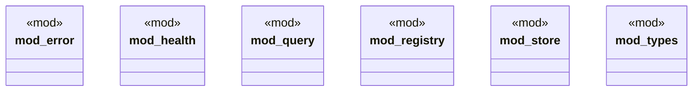

# `crates/ggen-lsp/src/a2a_mcp/a2a_registry/mod.rs`

Source SHA-256: `58aed633ff786be642d9a0116a542d3d341cf7b85d5d1913cf9f82d85f11508c`

## Dependencies

- `error::{RegistryError, RegistryResult}`
- `health::{ping_agent, HealthConfig, HealthMonitor}`
- `query::{matches_query, AgentQuery}`
- `registry::AgentRegistry`
- `store::{AgentStore, MemoryStore}`
- `types::{AgentEntry, HealthStatus, Registration}`

## Standing

- Structural parse: `ALIVE`
- Runtime behavior: `UNKNOWN`
