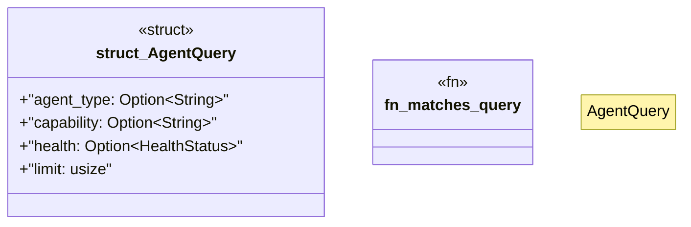

# `crates/ggen-lsp/src/a2a_mcp/a2a_registry/query.rs`

Source SHA-256: `fda00be996aae96092c67607bf8bad47d5f993f88a1fa8399049af98d74c49dc`

## Dependencies

- `crate::a2a_mcp::a2a_registry::types::HealthStatus`

## Standing

- Structural parse: `ALIVE`
- Runtime behavior: `UNKNOWN`
