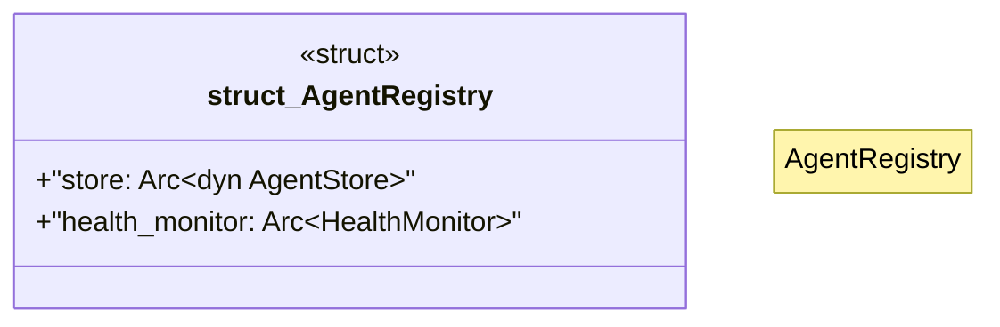

# `crates/ggen-lsp/src/a2a_mcp/a2a_registry/registry.rs`

Source SHA-256: `b8e40ca5f3b109f35dc98a4c8bb6861351a75871473286c8c47f59a95805a583`

## Dependencies

- `crate::a2a_mcp::a2a_registry::error::{RegistryError, RegistryResult}`
- `crate::a2a_mcp::a2a_registry::health::{ping_agent, HealthConfig, HealthMonitor}`
- `crate::a2a_mcp::a2a_registry::query::{matches_query, AgentQuery}`
- `crate::a2a_mcp::a2a_registry::store::AgentStore`
- `crate::a2a_mcp::a2a_registry::types::{AgentEntry, HealthStatus, Registration}`
- `std::sync::Arc`
- `tracing::{debug, info}`

## Standing

- Structural parse: `ALIVE`
- Runtime behavior: `UNKNOWN`
