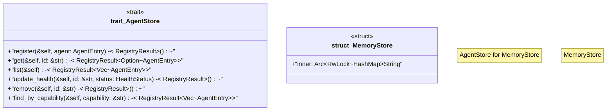

# `crates/ggen-lsp/src/a2a_mcp/a2a_registry/store.rs`

Source SHA-256: `7fd1986a8b0f63e58541881d2018d6fd1173e859dc88acb466dce9942214666c`

## Dependencies

- `async_trait::async_trait`
- `crate::a2a_mcp::a2a_registry::error::{RegistryError, RegistryResult}`
- `crate::a2a_mcp::a2a_registry::types::{AgentEntry, HealthStatus}`
- `std::collections::HashMap`
- `std::sync::Arc`
- `tokio::sync::RwLock`
- `tracing::debug`

## Standing

- Structural parse: `ALIVE`
- Runtime behavior: `UNKNOWN`
