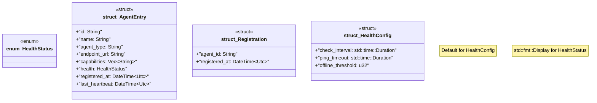

# `crates/ggen-lsp/src/a2a_mcp/a2a_registry/types.rs`

Source SHA-256: `4004c4a637dc4522e492ea9eb506766f96e16f997eeff6af3027bbbf8ee0c339`

## Dependencies

- `chrono::{DateTime, Utc}`
- `serde::{Deserialize, Serialize}`

## Standing

- Structural parse: `ALIVE`
- Runtime behavior: `UNKNOWN`
