# `crates/ggen-lsp/src/a2a_mcp/mcp_packs.rs`

Source SHA-256: `d373d1c34bfea2ce82c3e9c151f1e27bb1706b044af720ab1c955ea03736dc09`

```mermaid
classDiagram
    class fn_default_true {
      <<fn>>
    }
    class struct_PackSearchParams {
      <<struct>>
      +"query: String"
      +"limit: Option~usize~"
    }
    class struct_PackListParams {
      <<struct>>
      +"category: Option~String~"
    }
    class struct_PackShowParams {
      <<struct>>
      +"pack_id: String"
    }
    class struct_PackResolveParams {
      <<struct>>
      +"surface: String"
      +"projection: Option~String~"
      +"runtime: Option~String~"
    }
    class struct_PackCompatibilityParams {
      <<struct>>
      +"pack_ids: Vec~String~"
    }
    class struct_PackStatusParams {
      <<struct>>
      +"root: Option~String~"
    }
    class struct_PackVerifyParams {
      <<struct>>
      +"receipt_path: String"
      +"root: Option~String~"
    }
    class struct_PackInstallParams {
      <<struct>>
      +"pack_id: String"
      +"force: bool"
      +"dry_run: bool"
      +"emit_receipt: bool"
    }
    class struct_PackRemoveParams {
      <<struct>>
      +"pack_id: String"
    }
    class struct_PackCapabilitiesParams {
      <<struct>>
    }
    class fn_to_value {
      <<fn>>
    }
    class fn_agent_at {
      <<fn>>
    }
    class fn_capabilities_result {
      <<fn>>
    }
    class fn_search_result {
      <<fn>>
    }
    class fn_list_result {
      <<fn>>
    }
    class fn_show_result {
      <<fn>>
    }
    class fn_resolve_result {
      <<fn>>
    }
    class fn_status_result {
      <<fn>>
    }
    class fn_verify_result {
      <<fn>>
    }
    class fn_remove_result {
      <<fn>>
    }
    class fn_ocel_invoked {
      <<fn>>
    }
    class fn_mcp_ok {
      <<fn>>
    }
    class fn_mcp_err {
      <<fn>>
    }
    class fn_pack_agent_card {
      <<fn>>
    }
    class fn_parse_args {
      <<fn>>
    }
    class fn_agent_to_adapter_err {
      <<fn>>
    }
    class struct_PackToolsAdapter {
      <<struct>>
      +"initialized: bool"
    }
    class fn_subject_of {
      <<fn>>
    }
    note "Adapter for PackToolsAdapter"
    note "PackToolsAdapter"
```

## Dependencies

- `async_trait::async_trait`
- `crate::a2a_mcp::a2a_generated::adapter::{ Adapter, AdapterCapabilities, AdapterError, AdapterErrorType, }`
- `ggen_marketplace::agent::{AgentError, InstallRequest, PackAgent}`
- `rmcp::model::{CallToolResult, Content, ErrorData}`
- `serde::Deserialize`
- `serde_json::{json, Value}`
- `std::collections::HashMap`

## Standing

- Structural parse: `ALIVE`
- Runtime behavior: `UNKNOWN`
