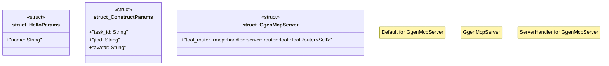

# `crates/ggen-lsp/src/a2a_mcp/mcp_server.rs`

Source SHA-256: `38a7e2067c433733ccd54a55eb379b0e696af884ee2dbae369955e4390f9e932`

## Dependencies

- `rmcp::handler::server::wrapper::Parameters`
- `rmcp::model::{CallToolResult, Content, Implementation, InitializeResult, ServerCapabilities}`
- `rmcp::{tool, tool_handler, tool_router, ServerHandler, ServiceExt}`

## Standing

- Structural parse: `ALIVE`
- Runtime behavior: `UNKNOWN`
