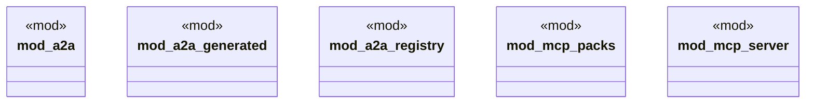

# `crates/ggen-lsp/src/a2a_mcp/mod.rs`

Source SHA-256: `6391c910368fb726b93baed172ccae1b3955d317ecc7b64934033e7d7bff7f0a`

## Dependencies

- `a2a::{ Artifact, ArtifactCollection, StateTransition, Task, TaskMessage, TaskState, TaskStateMachine, Transport, }`
- `a2a_generated::{Agent, AgentFactory, Message, Port, UnifiedAgent, UnifiedAgentBuilder}`
- `a2a_registry::{AgentEntry, AgentQuery, AgentRegistry, HealthMonitor, HealthStatus}`
- `mcp_packs::{dispatch_pack_tool, pack_agent_card, PackToolsAdapter, PACK_TOOLS}`

## Standing

- Structural parse: `ALIVE`
- Runtime behavior: `UNKNOWN`
