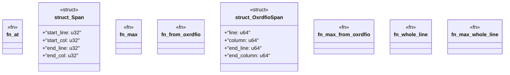

# `crates/ggen-lsp/src/analyzers/diag.rs`

Source SHA-256: `677b2121f1fa5b2148671266108b1d853bf7d7d56d7c0a327fb1c498683eb156`

## Dependencies

- `lsp_max::lsp_types_max::{Diagnostic, DiagnosticSeverity, NumberOrString, Position, Range}`
- `lsp_max_protocol::{LawAxis, MaxDiagnostic}`

## Standing

- Structural parse: `ALIVE`
- Runtime behavior: `UNKNOWN`
