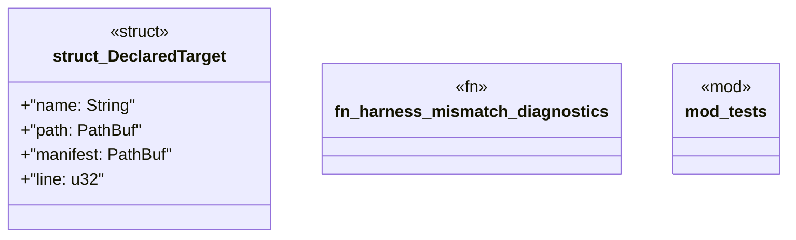

# `crates/ggen-lsp/src/analyzers/harness_analyzer.rs`

Source SHA-256: `f8ce081378fac807e3fd4b54ccca4c0e7d2734188b4d138b0af3cadf5e30a6c7`

## Dependencies

- `lsp_max::lsp_types::{Diagnostic, DiagnosticSeverity, NumberOrString, Position, Range}`
- `std::collections::BTreeSet`
- `std::path::PathBuf`
- `super::*`

## Standing

- Structural parse: `ALIVE`
- Runtime behavior: `UNKNOWN`
