# `crates/ggen-lsp/src/analyzers/mod.rs`

Source SHA-256: `3e2c51c994d38bd504f2b07b5742307887547b8e2ca815c82d9190af46f8635b`

```mermaid
classDiagram
    class mod_diag {
      <<mod>>
    }
    class mod_harness_analyzer {
      <<mod>>
    }
    class mod_rdf_analyzer {
      <<mod>>
    }
    class mod_source_law_analyzer {
      <<mod>>
    }
    class mod_sparql_analyzer {
      <<mod>>
    }
    class mod_tera_analyzer {
      <<mod>>
    }
    class mod_toml_analyzer {
      <<mod>>
    }
    class fn_detect_harness_001 {
      <<fn>>
    }
    class fn_detect_tpl_001 {
      <<fn>>
    }
    class fn_detect_out_001 {
      <<fn>>
    }
    class fn_detect_rule_001 {
      <<fn>>
    }
    class fn_detect_src_001 {
      <<fn>>
    }
    class fn_detect_src_002_003_in_dir {
      <<fn>>
    }
    class fn_detect_yield_001 {
      <<fn>>
    }
    class fn_detect_yield_004 {
      <<fn>>
    }
    class fn_detect_yield_003 {
      <<fn>>
    }
    class fn_detect_yield_005 {
      <<fn>>
    }
    class fn_detect_query_002 {
      <<fn>>
    }
    class fn_detect_pack_001 {
      <<fn>>
    }
    class fn_to_max_diagnostic {
      <<fn>>
    }
    class fn_select_projection_vars {
      <<fn>>
    }
    class fn_build_analyzer {
      <<fn>>
    }
    class trait_Analyzer {
      <<trait>>
      +"diagnostics(&self) -~ Vec~MaxDiagnostic~"
      +"completion_at(&self, line: u32, character: u32) -~ Option~CompletionResponse~"
      +"hover_at(&self, line: u32, character: u32) -~ Option~Hover~"
      +"definition_at(&self, line: u32, character: u32) -~ Option~Location~"
      +"references_at(&self, line: u32, character: u32) -~ Option~Vec~Location~~"
      +"semantic_tokens(&self) -~ Option~SemanticTokens~"
      +"document_symbols(&self, range: Option~Range~) -~ Vec~DocumentSymbol~"
      +"code_lenses(&self) -~ Option~Vec~CodeLens~~"
      +"folding_ranges(&self) -~ Option~Vec~FoldingRange~~"
      +"format_document(&self) -~ Option~Vec~TextEdit~~"
      +"inlay_hints(&self, range: Option~Range~) -~ Vec~InlayHint~"
      +"prepare_rename(&self, position: Position) -~ Option~Range~"
      +"rename_symbol(&self, position: Position, new_name: &str) -~ Option~WorkspaceEdit~"
      +"call_hierarchy_items(&self, position: Position) -~ Option~Vec~CallHierarchyItem~~"
      +"type_hierarchy_items(&self, position: Position) -~ Option~Vec~TypeHierarchyItem~~"
    }
    class enum_DocumentAnalyzer {
      <<enum>>
    }
    note "DocumentAnalyzer"
    note "fmt::Debug for DocumentAnalyzer"
```

## Dependencies

- `crate::state::FileType`
- `harness_analyzer::{harness_mismatch_diagnostics, DeclaredTarget, GGEN_HARNESS_001}`
- `lsp_max::lsp_types_max::{ CallHierarchyItem, CodeLens, CompletionResponse, DocumentSymbol, FoldingRange, Hover, InlayHint, Location, Position, Range, SemanticTokens, TextEdit, TypeHierarchyItem, WorkspaceEdit, }`
- `lsp_max_protocol::MaxDiagnostic`
- `rdf_analyzer::{RdfAnalyzer, RdfFlavor}`
- `source_law_analyzer::{do_not_edit_diagnostics, GGEN_SRC_002, GGEN_SRC_003}`
- `sparql_analyzer::SparqlAnalyzer`
- `std::collections::BTreeSet`
- `std::fmt`
- `tera_analyzer::{ is_select_star, lexical_clean, pack_001_diagnostics, select_star_diagnostics, strip_tera_vars, unbound_output_path_diagnostics, unbound_projection_diagnostics, unbound_rule_file_diagnostics, yield_001_diagnostics, yield_003_diagnostics, yield_004_diagnostics, yield_005_diagnostics, TeraAnalyzer, GGEN_OUT_001, GGEN_PACK_001, GGEN_QUERY_002, GGEN_RULE_001, GGEN_TPL_001, GGEN_YIELD_001, GGEN_YIELD_003, GGEN_YIELD_004, GGEN_YIELD_005, }`
- `toml_analyzer::{source_caste_path_violation, TomlAnalyzer, GGEN_SRC_001}`

## Standing

- Structural parse: `ALIVE`
- Runtime behavior: `UNKNOWN`
