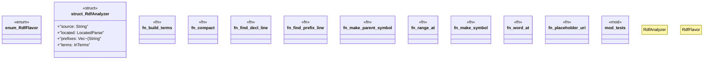

# `crates/ggen-lsp/src/analyzers/rdf_analyzer.rs`

Source SHA-256: `7468ca2ec023a1dbb09bd6ba9a0297b8585dd66341274ac687a776ab5b2c96e1`

## Dependencies

- `crate::analyzers::diag`
- `ggen_graph::{ extract_prefixes, iri_terms, parse_nquads_located, parse_ntriples_located, parse_turtle_located, DeterministicGraph, IriTerms, LocatedParse, }`
- `lsp_max::lsp_types::{ CompletionItem, CompletionItemKind, CompletionResponse, DiagnosticSeverity, Hover, HoverContents, Location, MarkupContent, MarkupKind, Position, Range, SymbolKind, TextEdit, Url, WorkspaceEdit, }`
- `super::*`

## Standing

- Structural parse: `ALIVE`
- Runtime behavior: `UNKNOWN`
