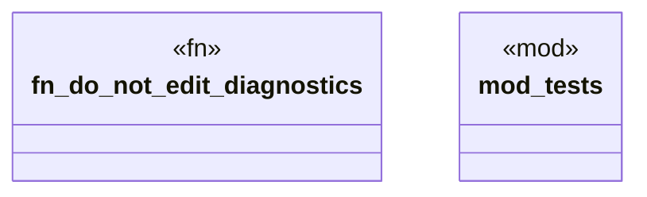

# `crates/ggen-lsp/src/analyzers/source_law_analyzer.rs`

Source SHA-256: `8e8027e35cd61afb753d35e122453b4eece3e431bb86f77711919ddc9d8c5bbc`

## Dependencies

- `crate::analyzers::diag`
- `lsp_max::lsp_types::{Diagnostic, DiagnosticSeverity}`
- `super::*`

## Standing

- Structural parse: `ALIVE`
- Runtime behavior: `UNKNOWN`
