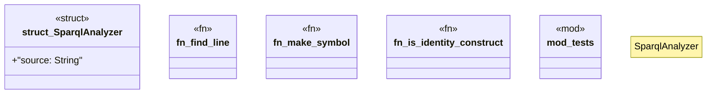

# `crates/ggen-lsp/src/analyzers/sparql_analyzer.rs`

Source SHA-256: `795062e28313da48eee28647d04686b3000a5ed1bf23d5a1e24a16423f1a7d5c`

## Dependencies

- `crate::analyzers::diag`
- `ggen_config::manifest::validation::{query_contains_values, query_has_order_by}`
- `ggen_graph::{check_sparql_syntax, sparql_kind, SparqlKind}`
- `lsp_max::lsp_types::{ CompletionItem, CompletionItemKind, CompletionResponse, DiagnosticSeverity, Hover, Location, Position, Range, SymbolKind, TextEdit, WorkspaceEdit, }`
- `std::collections::BTreeSet`
- `super::*`

## Standing

- Structural parse: `ALIVE`
- Runtime behavior: `UNKNOWN`
