# `crates/ggen-lsp/src/analyzers/tera_analyzer.rs`

Source SHA-256: `cd8d17f868e86fa4f92cc6bbf2d6f0ded5519328c9f6698af961802955213fc0`

```mermaid
classDiagram
    class struct_TeraAnalyzer {
      <<struct>>
      +"source: String"
      +"available_vars: BTreeSet~String~"
    }
    class fn_code_lenses {
      <<fn>>
    }
    class fn_folding_ranges {
      <<fn>>
    }
    class fn_format_document {
      <<fn>>
    }
    class fn_inlay_hints {
      <<fn>>
    }
    class fn_rename_symbol {
      <<fn>>
    }
    class fn_call_hierarchy_items {
      <<fn>>
    }
    class fn_make_symbol {
      <<fn>>
    }
    class fn_word_at {
      <<fn>>
    }
    class fn_local_vars {
      <<fn>>
    }
    class fn_consumed_vars {
      <<fn>>
    }
    class fn_bracket_keys {
      <<fn>>
    }
    note "TeraAnalyzer"
```

## Dependencies

- `crate::analyzers::diag`
- `lsp_max::lsp_types::NumberOrString`
- `lsp_max::lsp_types::{ CallHierarchyItem, CodeLens, CompletionItem, CompletionItemKind, CompletionResponse, DiagnosticSeverity, DocumentSymbol, FoldingRange, FoldingRangeKind, Hover, InlayHint, Location, Position, Range, SymbolKind, TextEdit, WorkspaceEdit, }`
- `lsp_max_protocol::MaxDiagnostic`
- `std::collections::BTreeSet`
- `std::path::Path`
- `std::path::PathBuf`
- `super::*`

## Standing

- Structural parse: `ALIVE`
- Runtime behavior: `UNKNOWN`
