# `crates/ggen-lsp/src/analyzers/toml_analyzer.rs`

Source SHA-256: `a9e6643ed5b13bb910c0800d3b8f463b0262191c03d57b172bb349357d37191d`

```mermaid
classDiagram
    class fn_source_caste_path_violation {
      <<fn>>
    }
    class struct_TomlAnalyzer {
      <<struct>>
      +"source: String"
    }
    class fn_completion_at {
      <<fn>>
    }
    class fn_hover_at {
      <<fn>>
    }
    class fn_semantic_tokens {
      <<fn>>
    }
    class fn_document_symbols {
      <<fn>>
    }
    class fn_code_lenses {
      <<fn>>
    }
    class fn_folding_ranges {
      <<fn>>
    }
    class fn_format_document {
      <<fn>>
    }
    class fn_inlay_hints {
      <<fn>>
    }
    class fn_rename_symbol {
      <<fn>>
    }
    class fn_byte_to_line_col {
      <<fn>>
    }
    class fn_section_fold {
      <<fn>>
    }
    class fn_make_symbol {
      <<fn>>
    }
    class mod_tests {
      <<mod>>
    }
    note "TomlAnalyzer"
```

## Dependencies

- `crate::analyzers::diag`
- `lsp_max::lsp_types::{ CodeLens, CompletionItem, CompletionItemKind, CompletionResponse, DiagnosticSeverity, DocumentSymbol, FoldingRange, Hover, HoverContents, InlayHint, MarkupContent, MarkupKind, Position, Range, SymbolKind, TextEdit, WorkspaceEdit, }`
- `super::*`

## Standing

- Structural parse: `ALIVE`
- Runtime behavior: `UNKNOWN`
