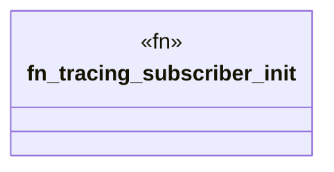

# `crates/ggen-lsp/src/bin/ggen-lsp-mcp.rs`

Source SHA-256: `048ae7397c5fe0293054d256dc56cb34475aa72160889888b7e2610d678b44f6`

## Dependencies

- `ggen_lsp::mcp::RepairRouteServer`
- `rmcp::ServiceExt`

## Standing

- Structural parse: `ALIVE`
- Runtime behavior: `UNKNOWN`
