# `crates/ggen-lsp/src/check.rs`

Source SHA-256: `d6c9472532ca2f8b9af085b46df99904ce400aa852f6102d7506d6712026855e`

```mermaid
classDiagram
    class struct_FileReport {
      <<struct>>
      +"path: String"
      +"diagnostics: Vec~Diagnostic~"
      +"routes: Vec~crate::route::RoutePlan~"
    }
    class struct_NamedCount {
      <<struct>>
      +"name: String"
      +"count: usize"
    }
    class struct_RouteSummary {
      <<struct>>
      +"routed: usize"
      +"unrouted: usize"
      +"top_routes: Vec~NamedCount~"
    }
    class struct_CheckReport {
      <<struct>>
      +"files: Vec~FileReport~"
      +"error_count: usize"
      +"warning_count: usize"
      +"route_summary: Option~RouteSummary~"
    }
    class fn_diag_code {
      <<fn>>
    }
    class fn_severity_str {
      <<fn>>
    }
    class fn_span_str {
      <<fn>>
    }
    class fn_route_source {
      <<fn>>
    }
    class fn_receipt_id_for {
      <<fn>>
    }
    class fn_capture_request {
      <<fn>>
    }
    class fn_check_content {
      <<fn>>
    }
    class fn_check_files {
      <<fn>>
    }
    class fn_check_files_with_routes {
      <<fn>>
    }
    class fn_check_files_in_root {
      <<fn>>
    }
    class fn_fold_tpl_001 {
      <<fn>>
    }
    class fn_fold_species {
      <<fn>>
    }
    class fn_fold_harness_001 {
      <<fn>>
    }
    class fn_fold_out_001 {
      <<fn>>
    }
    class fn_fold_rule_001 {
      <<fn>>
    }
    class fn_fold_yield_001 {
      <<fn>>
    }
    class fn_fold_yield_003 {
      <<fn>>
    }
    class fn_fold_yield_004 {
      <<fn>>
    }
    class fn_fold_yield_005 {
      <<fn>>
    }
    class fn_fold_query_002 {
      <<fn>>
    }
    class fn_fold_pack_001 {
      <<fn>>
    }
    class fn_fold_src_001 {
      <<fn>>
    }
    class fn_fold_src_002_003 {
      <<fn>>
    }
    class fn_paths_match {
      <<fn>>
    }
    class fn_summarize_routes {
      <<fn>>
    }
    class fn_discover_law_surfaces {
      <<fn>>
    }
    class mod_tests {
      <<mod>>
    }
    note "CheckReport"
    note "FileReport"
```

## Dependencies

- `crate::analyzers::build_analyzer`
- `crate::intel::IntelLog`
- `crate::intel::events::{ attach_attribution, diagnostic_raised, gate_result, new_run_id, receipt_emitted, refusal_emitted, repair_suggested, route_selected, }`
- `crate::state::FileType`
- `lsp_max::lsp_types::{Diagnostic, DiagnosticSeverity}`
- `lsp_max_protocol::MaxDiagnostic`
- `serde::Serialize`
- `std::collections::BTreeMap`
- `std::fs`
- `std::path::{Path, PathBuf}`
- `super::*`
- `walkdir::WalkDir`

## Standing

- Structural parse: `ALIVE`
- Runtime behavior: `UNKNOWN`
