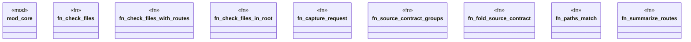

# `crates/ggen-lsp/src/check_ext.rs`

Source SHA-256: `30e0b0e64e3c3bcff0ea604ab61dc9bba68516397a8fed38b947b9ca99d03dce`

## Dependencies

- `core::{ check_content, discover_law_surfaces, CheckReport, FileReport, NamedCount, RouteSummary, }`
- `lsp_max::lsp_types::DiagnosticSeverity`
- `std::collections::BTreeMap`
- `std::path::{Path, PathBuf}`

## Standing

- Structural parse: `ALIVE`
- Runtime behavior: `UNKNOWN`
