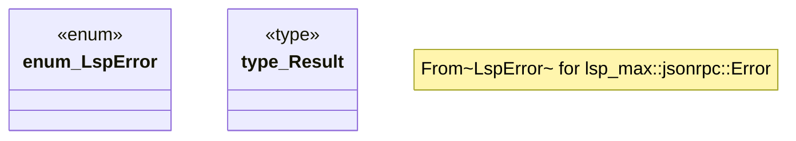

# `crates/ggen-lsp/src/error.rs`

Source SHA-256: `a76cbaf87ad711c2b14c08771ce4b702106ff5594c051340fd76eadd2bd4a932`

## Dependencies

- `thiserror::Error`

## Standing

- Structural parse: `ALIVE`
- Runtime behavior: `UNKNOWN`
