# `crates/ggen-lsp/src/features/code_lens.rs`

Source SHA-256: `185c09b7774c7651623bf70d916be611521a18e7762c43e54e166798db8ea3cf`

```mermaid
classDiagram
    class fn_code_lenses {
      <<fn>>
    }
    class fn_rdf_lenses {
      <<fn>>
    }
    class fn_declared_classes {
      <<fn>>
    }
    class fn_declares_class {
      <<fn>>
    }
    class fn_domain_counts {
      <<fn>>
    }
    class fn_leading_subject {
      <<fn>>
    }
    class fn_sparql_lenses {
      <<fn>>
    }
    class fn_distinct_variables {
      <<fn>>
    }
    class fn_toml_lenses {
      <<fn>>
    }
    class fn_is_section_header {
      <<fn>>
    }
    class fn_is_key_line {
      <<fn>>
    }
    class fn_strip_comment {
      <<fn>>
    }
    class fn_whole_line {
      <<fn>>
    }
    class mod_tests {
      <<mod>>
    }
```

## Dependencies

- `crate::state::FileType`
- `lsp_max::lsp_types::{CodeLens, Command, Position, Range}`
- `serde_json::Value`
- `super::*`

## Standing

- Structural parse: `ALIVE`
- Runtime behavior: `UNKNOWN`
