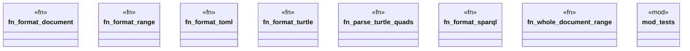

# `crates/ggen-lsp/src/features/formatting.rs`

Source SHA-256: `a94df524090d3024811c67ff7fca1fa62a1373c12371c5f167c5c9e33c56c490`

## Dependencies

- `crate::state::FileType`
- `lsp_max::lsp_types::{Position, Range, TextEdit}`
- `oxigraph::io::{RdfFormat, RdfParser, RdfSerializer}`
- `oxigraph::model::Quad`
- `super::*`

## Standing

- Structural parse: `ALIVE`
- Runtime behavior: `UNKNOWN`
