# `crates/ggen-lsp/src/features/inlay_hint.rs`

Source SHA-256: `1a333567243e8a8453cb054a5ce14f0a61a93edd59a557bd1c2803fc4f4c9376`

```mermaid
classDiagram
    class fn_inlay_hints {
      <<fn>>
    }
    class fn_rdf_hints {
      <<fn>>
    }
    class fn_sparql_hints {
      <<fn>>
    }
    class fn_toml_hints {
      <<fn>>
    }
    class struct_PrefixedToken {
      <<struct>>
      +"text: String"
      +"end_col: u32"
    }
    class fn_prefixed_names {
      <<fn>>
    }
    class fn_resolve {
      <<fn>>
    }
    class fn_iri_hint {
      <<fn>>
    }
    class fn_parse_turtle_prefixes {
      <<fn>>
    }
    class fn_parse_sparql_prefixes {
      <<fn>>
    }
    class fn_parse_prefix_body {
      <<fn>>
    }
    class fn_position_in_range {
      <<fn>>
    }
    class mod_tests {
      <<mod>>
    }
```

## Dependencies

- `crate::state::FileType`
- `lsp_max::lsp_types::{InlayHint, InlayHintKind, InlayHintLabel, Position, Range}`
- `super::*`

## Standing

- Structural parse: `ALIVE`
- Runtime behavior: `UNKNOWN`
