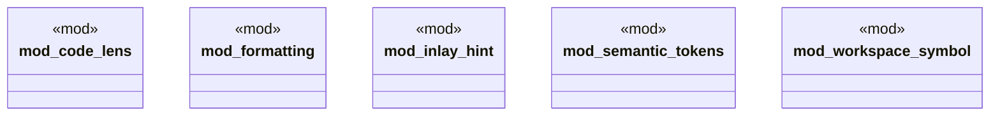

# `crates/ggen-lsp/src/features/mod.rs`

Source SHA-256: `d7f1dda5f40691206ec6cf01a17e1a2a338c8036c70ccdd471abcff9bd45b571`

## Dependencies

- None observed.

## Standing

- Structural parse: `ALIVE`
- Runtime behavior: `UNKNOWN`
