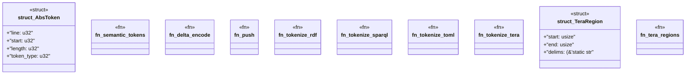

# `crates/ggen-lsp/src/features/semantic_tokens.rs`

Source SHA-256: `e1a13dcdc294f1a81811cf1c08abad2539901f0baee316da5d0ca573b154f281`

## Dependencies

- `crate::state::FileType`
- `lsp_max::lsp_types::{SemanticToken, SemanticTokens}`

## Standing

- Structural parse: `ALIVE`
- Runtime behavior: `UNKNOWN`
