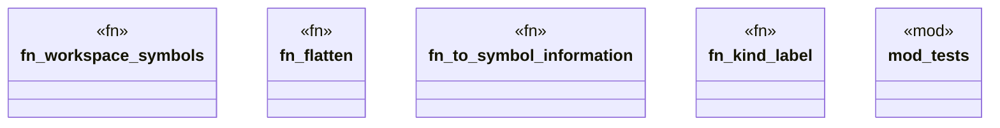

# `crates/ggen-lsp/src/features/workspace_symbol.rs`

Source SHA-256: `f4542e6174dc851b404ecf65c2da562f35fae3d0c8ae1deac38059959ffeb833`

## Dependencies

- `lsp_max::lsp_types::{Location, SymbolInformation, SymbolKind, Url}`
- `std::fs`
- `std::path::Path`
- `super::*`

## Standing

- Structural parse: `ALIVE`
- Runtime behavior: `UNKNOWN`
