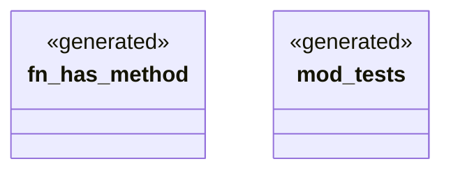

# `crates/ggen-lsp/src/generated_contract.rs`

Source SHA-256: `e22648c0b936734055766e1e2b6a5784e357afbe891b547a4b2aff06f76f859e`

## Dependencies

- `super::*`

## Standing

- Structural parse: `ALIVE`
- Runtime behavior: `UNKNOWN`
