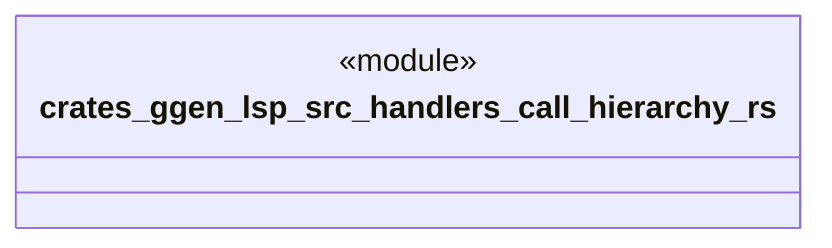

# `crates/ggen-lsp/src/handlers/call_hierarchy.rs`

Source SHA-256: `a07d0c737e93fc565c24252d56da98340adeaba456d65785a982c3d458e8ef4b`

## Dependencies

- `crate::server::GgenLanguageServer`
- `lsp_max::jsonrpc::Result`
- `lsp_max::lsp_types_max::*`

## Standing

- Structural parse: `ALIVE`
- Runtime behavior: `UNKNOWN`
