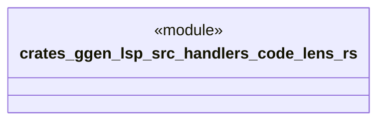

# `crates/ggen-lsp/src/handlers/code_lens.rs`

Source SHA-256: `88c5d5ae9933cfaf70d12aa7109c2b59bcb9e177d1214e1ff5deadbb7a51a903`

## Dependencies

- `crate::server::GgenLanguageServer`
- `lsp_max::jsonrpc::Result`
- `lsp_max::lsp_types_max::*`

## Standing

- Structural parse: `ALIVE`
- Runtime behavior: `UNKNOWN`
