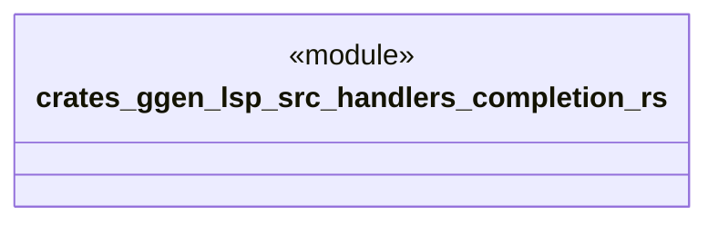

# `crates/ggen-lsp/src/handlers/completion.rs`

Source SHA-256: `b1de03c8b76cb82c683ed904e5e1bbb46d7ed8f8004dd7fd6e6a9e9e7e9aa0e9`

## Dependencies

- `crate::server::GgenLanguageServer`
- `lsp_max::jsonrpc::Result`
- `lsp_max::lsp_types_max::*`

## Standing

- Structural parse: `ALIVE`
- Runtime behavior: `UNKNOWN`
