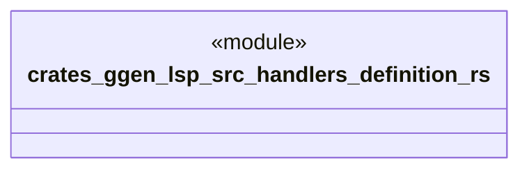

# `crates/ggen-lsp/src/handlers/definition.rs`

Source SHA-256: `fb3bd233a1bc76bdeef9480edef556b85abf27be15d3e49f62ea7f1fe180841b`

## Dependencies

- `crate::server::GgenLanguageServer`
- `lsp_max::jsonrpc::Result`
- `lsp_max::lsp_types_max::*`

## Standing

- Structural parse: `ALIVE`
- Runtime behavior: `UNKNOWN`
