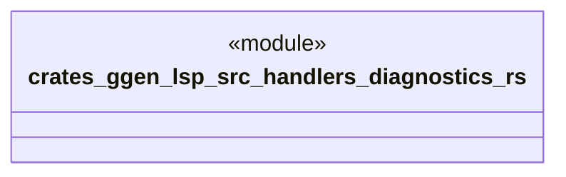

# `crates/ggen-lsp/src/handlers/diagnostics.rs`

Source SHA-256: `92d94be1a4a7088508919caa7da62d29b63898de4ab7e8a512176280b06fe683`

## Dependencies

- `crate::server::GgenLanguageServer`
- `lsp_max::jsonrpc::Result`
- `lsp_max::lsp_types_max::*`

## Standing

- Structural parse: `ALIVE`
- Runtime behavior: `UNKNOWN`
