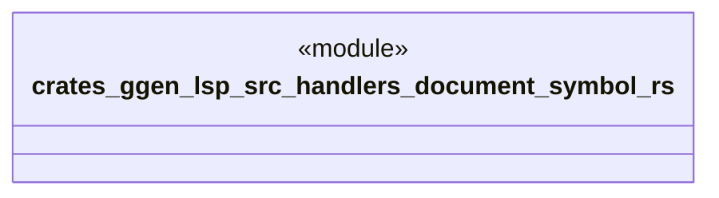

# `crates/ggen-lsp/src/handlers/document_symbol.rs`

Source SHA-256: `007021538276e69b5cc2bbd416eec7da564aa8d4d6285084b48f0aa92d24877f`

## Dependencies

- `crate::server::GgenLanguageServer`
- `lsp_max::jsonrpc::Result`
- `lsp_max::lsp_types_max::*`

## Standing

- Structural parse: `ALIVE`
- Runtime behavior: `UNKNOWN`
