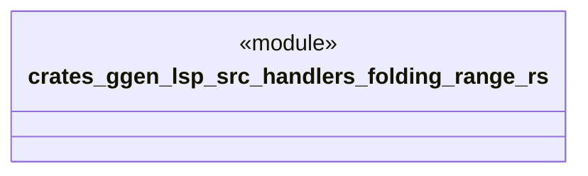

# `crates/ggen-lsp/src/handlers/folding_range.rs`

Source SHA-256: `e6c9d54bb98079ac3d1632000acc10a32a80b09729257734f4ee809b54334cbf`

## Dependencies

- `crate::server::GgenLanguageServer`
- `lsp_max::jsonrpc::Result`
- `lsp_max::lsp_types_max::*`

## Standing

- Structural parse: `ALIVE`
- Runtime behavior: `UNKNOWN`
