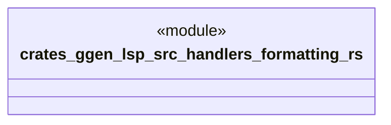

# `crates/ggen-lsp/src/handlers/formatting.rs`

Source SHA-256: `367e2b3a801d39680b2ce27a4e467a862731cc8de3b157de04908ce2c394dd7f`

## Dependencies

- `crate::server::GgenLanguageServer`
- `lsp_max::jsonrpc::Result`
- `lsp_max::lsp_types_max::*`

## Standing

- Structural parse: `ALIVE`
- Runtime behavior: `UNKNOWN`
