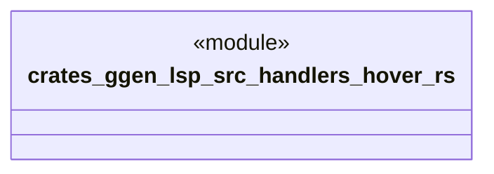

# `crates/ggen-lsp/src/handlers/hover.rs`

Source SHA-256: `1dbaaed4d4264381ab3e6f9565c75068b1f54971ccec7bc2737dc9b5bc1702c4`

## Dependencies

- `crate::server::GgenLanguageServer`
- `lsp_max::jsonrpc::Result`
- `lsp_max::lsp_types_max::*`

## Standing

- Structural parse: `ALIVE`
- Runtime behavior: `UNKNOWN`
