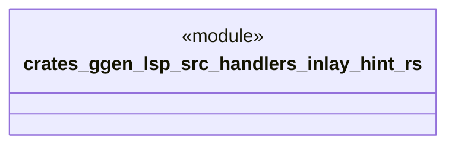

# `crates/ggen-lsp/src/handlers/inlay_hint.rs`

Source SHA-256: `66bc5b4d5f089e048de05fe92dd0050607d3d30b53490c98202faa75a04ef005`

## Dependencies

- `crate::server::GgenLanguageServer`
- `lsp_max::jsonrpc::Result`
- `lsp_max::lsp_types_max::*`

## Standing

- Structural parse: `ALIVE`
- Runtime behavior: `UNKNOWN`
