# `crates/ggen-lsp/src/handlers/mod.rs`

Source SHA-256: `2808e70ba115ddc55ab58d050c1ab5d02eb7e7579ed58a15335cf904d892f599`

```mermaid
classDiagram
    class mod_call_hierarchy {
      <<mod>>
    }
    class mod_code_lens {
      <<mod>>
    }
    class mod_completion {
      <<mod>>
    }
    class mod_definition {
      <<mod>>
    }
    class mod_diagnostics {
      <<mod>>
    }
    class mod_document_symbol {
      <<mod>>
    }
    class mod_folding_range {
      <<mod>>
    }
    class mod_formatting {
      <<mod>>
    }
    class mod_hover {
      <<mod>>
    }
    class mod_inlay_hint {
      <<mod>>
    }
    class mod_references {
      <<mod>>
    }
    class mod_rename {
      <<mod>>
    }
    class mod_semantic_tokens {
      <<mod>>
    }
    class mod_type_hierarchy {
      <<mod>>
    }
    class mod_workspace_symbol {
      <<mod>>
    }
```

## Dependencies

- None observed.

## Standing

- Structural parse: `ALIVE`
- Runtime behavior: `UNKNOWN`
