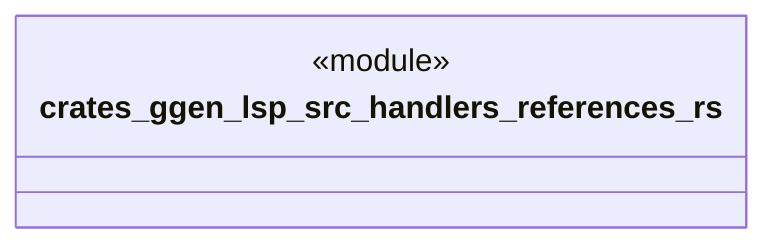

# `crates/ggen-lsp/src/handlers/references.rs`

Source SHA-256: `3e105560e2311cf9eb9e70052945376d66b816e84f999d23559f8733c9a888c1`

## Dependencies

- `crate::server::GgenLanguageServer`
- `lsp_max::jsonrpc::Result`
- `lsp_max::lsp_types_max::*`

## Standing

- Structural parse: `ALIVE`
- Runtime behavior: `UNKNOWN`
