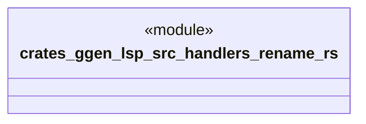

# `crates/ggen-lsp/src/handlers/rename.rs`

Source SHA-256: `373d6d7633e6f961a4ef5f0df4e22617317fd592ee70c952279933df4550d56a`

## Dependencies

- `crate::server::GgenLanguageServer`
- `lsp_max::jsonrpc::Result`
- `lsp_max::lsp_types_max::*`

## Standing

- Structural parse: `ALIVE`
- Runtime behavior: `UNKNOWN`
