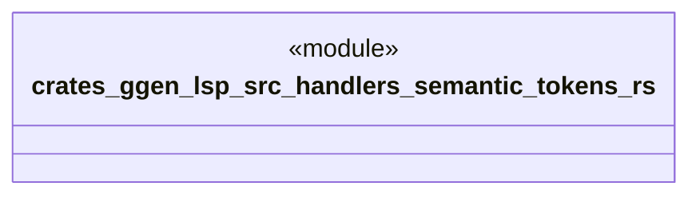

# `crates/ggen-lsp/src/handlers/semantic_tokens.rs`

Source SHA-256: `826a52c078338c079524e60679a37c18a301f99d0eacf0e55efa10ef12a22f82`

## Dependencies

- `crate::server::GgenLanguageServer`
- `lsp_max::jsonrpc::Result`
- `lsp_max::lsp_types_max::*`

## Standing

- Structural parse: `ALIVE`
- Runtime behavior: `UNKNOWN`
