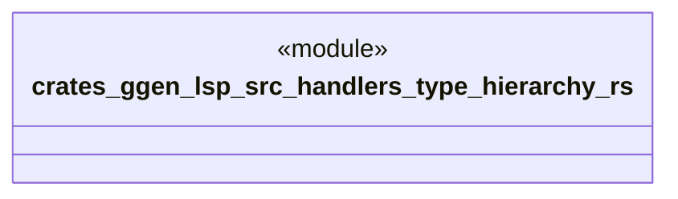

# `crates/ggen-lsp/src/handlers/type_hierarchy.rs`

Source SHA-256: `0253a45654ae54aedbeac17e62da81b753fb7076060d609e73a8ebd892f406b1`

## Dependencies

- `crate::server::GgenLanguageServer`
- `lsp_max::jsonrpc::Result`
- `lsp_max::lsp_types_max::*`

## Standing

- Structural parse: `ALIVE`
- Runtime behavior: `UNKNOWN`
