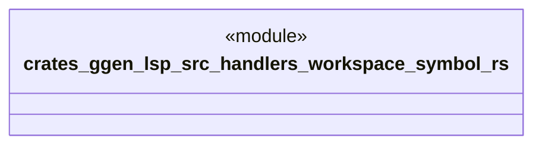

# `crates/ggen-lsp/src/handlers/workspace_symbol.rs`

Source SHA-256: `4a8cf3b298d2246668be617de555d12cc72c998dc5ea8084b9514eb8f1ff58fa`

## Dependencies

- `crate::server::GgenLanguageServer`
- `lsp_max::jsonrpc::Result`
- `lsp_max::lsp_types_max::*`

## Standing

- Structural parse: `ALIVE`
- Runtime behavior: `UNKNOWN`
