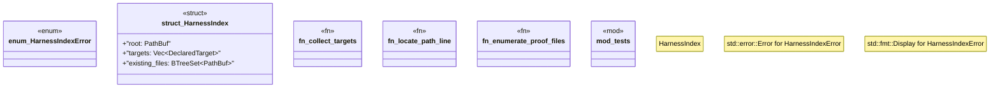

# `crates/ggen-lsp/src/harness_index.rs`

Source SHA-256: `e04c6695a0fd1996cebe45c8d34924b40818ed59fdb0b7ab4aa200aea847a956`

## Dependencies

- `crate::analyzers::DeclaredTarget`
- `crate::project_index::BufferOverlay`
- `std::collections::BTreeSet`
- `std::path::{Path, PathBuf}`
- `super::*`
- `tempfile::TempDir`
- `walkdir::WalkDir`

## Standing

- Structural parse: `ALIVE`
- Runtime behavior: `UNKNOWN`
