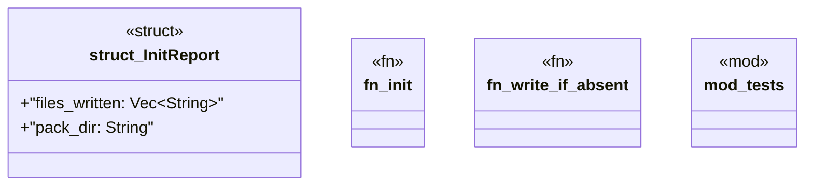

# `crates/ggen-lsp/src/init.rs`

Source SHA-256: `bfb2d08fa1212e9195e0ac0ee8027e4e6cd5dd35a2bedd619ca9cf7e4a13e9dc`

## Dependencies

- `crate::pack::{emit, PackOptions}`
- `std::io`
- `std::path::Path`
- `super::*`
- `tempfile::TempDir`

## Standing

- Structural parse: `ALIVE`
- Runtime behavior: `UNKNOWN`
